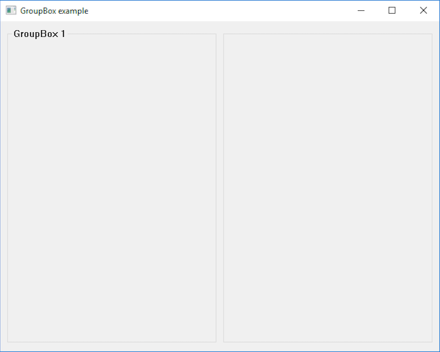

# GroupBox

This example demonstrates the use of GroupBox container.

# Source

[GroupBox.cpp](GroupBox.cpp)

[CMakeLists.txt](CMakeLists.txt)

# Generate and build

To build this project, open "Console" and type following lines:

``` shell
mkdir build && cd build
cmake .. 
start GroupBox.sln
```

Select "GroupBox" project and type Ctrl+F5 to build and run it.

# Output


