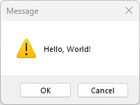

# MessageBox

This example demonstrates the use of MessageBox dialog.

## Sources

[MessageBox.cpp](MessageBox.cpp)

[CMakeLists.txt](CMakeLists.txt)

## Generate and build

To build this project, open "Console" and type following lines:

``` shell
mkdir build && cd build
cmake .. 
start MessageBox.sln
```

Select "MessageBox" project and type Ctrl+F5 to build and run it.

## Output


