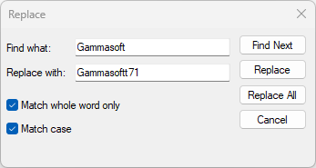

# ReplaceDialog

This example demonstrates the use of ReplaceDialog dialog.

## Sources

[ReplaceDialog.cpp](ReplaceDialog.cpp)

[CMakeLists.txt](CMakeLists.txt)

## Generate and build

To build this project, open "Console" and type following lines:

``` shell
mkdir build && cd build
cmake .. 
start ReplaceDialog.sln
```

Select "ReplaceDialog" project and type Ctrl+F5 to build and run it.

## Output


