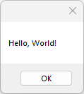

# HelloWorldMessageBox

The classic first application "Hello World".

# Source

[HelloWorldMessageBox.cpp](HelloWorldMessageBox.cpp)

[CMakeLists.txt](CMakeLists.txt)

# Generate and build

To build this project, open "Console" and type following lines:

``` shell
mkdir build && cd build
cmake .. 
start HelloWorldMessageBox.sln
```

Select "HelloWorldMessageBox" project and type Ctrl+F5 to build and run it.

# Output




