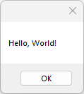

# HelloWorldMessageBox2

The classic first application "Hello World".

## Sources

[HelloWorldMessageBox2.cpp](HelloWorldMessageBox2.cpp)

[CMakeLists.txt](CMakeLists.txt)

## Generate and build

To build this project, open "Console" and type following lines:

``` shell
mkdir build && cd build
cmake .. 
start HelloWorldMessageBox2.sln
```

Select "HelloWorldMessageBox2" project and type Ctrl+F5 to build and run it.

## Output




