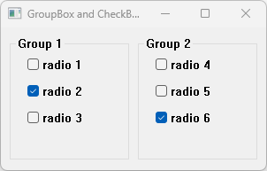

# GroupBoxAndCheckBox

This example demonstrates the use of GroupBox container and CheckBox controls.

# Source

[GroupBoxAndCheckBox.cpp](GroupBoxAndCheckBox.cpp)

[CMakeLists.txt](CMakeLists.txt)

# Generate and build

To build this project, open "Console" and type following lines:

``` shell
mkdir build && cd build
cmake .. 
start GroupBoxAndCheckBox.sln
```

Select "GroupBoxAndCheckBox" project and type Ctrl+F5 to build and run it.

# Output


