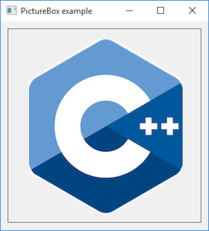

# PictureBox2

This example demonstrates the use PictureBox from bitmap resource.

# Source

[Resources/Logo.bmp](Resources/Logo.bmp)

[PictureBox2.cpp](PictureBox2.cpp)

[PictureBox2.h](PictureBox2.h)

[PictureBox2.rc](PictureBox2.rc)

[CMakeLists.txt](CMakeLists.txt)

# Generate and build

To build this project, open "Console" and type following lines:

``` shell
mkdir build && cd build
cmake .. 
start PictureBox2.sln
```

Select "PictureBox2" project and type Ctrl+F5 to build and run it.

# Output




