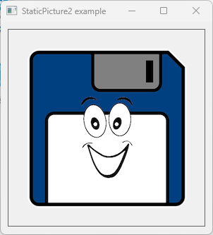

# StaticPicture2

This example demonstrates the use PictureBox from bitmap resource.

## Sources

[Resources/Logo.bmp](Resources/Logo.bmp)

[StaticPicture2.cpp](StaticPicture2.cpp)

[StaticPicture2.h](StaticPicture2.h)

[StaticPicture2.rc](StaticPicture2.rc)

[CMakeLists.txt](CMakeLists.txt)

## Generate and build

To build this project, open "Console" and type following lines:

``` shell
mkdir build && cd build
cmake .. 
start StaticPicture2.sln
```

Select "StaticPicture2" project and type Ctrl+F5 to build and run it.

## Output




