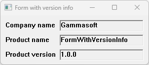

# WindowWithVersionInfo

This example demonstrates the use of Form control and version informations.

## Sources

[WindowWithVersionInfo.cpp](WindowWithVersionInfo.cpp)

[WindowWithVersionInfo.rc](WindowWithVersionInfo.rc)

[CMakeLists.txt](CMakeLists.txt)

## Generate and build

To build this project, open "Console" and type following lines:

``` shell
mkdir build && cd build
cmake .. 
start WindowWithVersionInfo.sln
```

Select "WindowWithVersionInfo" project and type Ctrl+F5 to build and run it.

## Output


