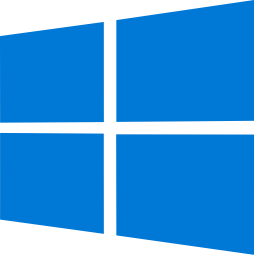

# Win32.Gui Examples

Shows how to use [Win32](https://learn.microsoft.com/en-us/windows/win32/api/) controls by proghramming code ([c++17](https://en.cppreference.com/w/)).

[](https://gammasoft71.wixsite.com/gammasoft/win32)

## Hello Worlds

* [HelloWorldEmoticons](HelloWorlds/HelloWorldEmoticons/README.md) The classic first application HelloWorld width emoticons.
* [HelloWorldMessageBox](HelloWorlds/HelloWorldMessageBox/README.md) The classic first application HelloWorld with MessageBox.
* [HelloWorldMessageBox2](HelloWorlds/HelloWorldMessageBox2/README.md) The classic first application HelloWorld with MessageBox.
* [HelloWorldPaint](HelloWorlds/HelloWorldPaint/README.md) The classic first application HelloWorld with GDI+ drawing objects.
* [HelloWorldStaticText](HelloWorlds/HelloWorldStaticText/README.md) The classic first application HelloWorld with StaticText control.

## Applications

* [Application](Applications/Application/README.md) Shows how to create an Application.
* [ApplicationIcon](Applications/ApplicationIcon/README.md) Shows how to create an executable with icon.

## Controls

* [Button](Controls/Button/README.md) Shows how to create a Button and Event Click.
* [CheckBox](Controls/CheckBox/README.md) Shows how to create a CheckBox.
* [ComboBox](Controls/ComboBox/README.md) Shows how to create a ComboBox.
* [ProgressBar](Controls/ProgressBar/README.md) Shows how to create a ProgressBar.
* [RadioButton](Controls/RadioButton/README.md) Shows how to create a RadioButton.
* [StaticPicture](Controls/StaticPicture/README.md) Shows how to create a SttaticPicture from bitmap file.
* [StaticText](Controls/StaticText/README.md) Shows how to create a StaticText.
* [TextBox](Controls/TextBox/README.md) Shows how to create a TextBox.
* [TrackBar](Controls/TrackBar/README.md) Shows how to create a TrackBar.

## Containers

* [GroupBox](Containers/GroupBox/README.md) Shows how to create a GroupBox.
* [Panel](Containers/Panel/README.md) Shows how to create a Panel.
* [TabControl](Containers/TabControl/README.md) Shows how to create a TabControl.

## Menus and toolbars

* [MainMenu](MenusAndToolbars/MainMenu/README.md) Shows how to create a MainMenu.
* [Toolbar](MenusAndToolbars/Toolbar/README.md) Shows how to create a Toolbar.

## Windows

* [Window](Windows/Window/README.md) Shows how to create a Window.

## Dialogs

* [AboutBox](Dialogs/AboutBox/README.md) Shows how to create an AboutBox.
* [ColorDialog](Dialogs/ColorDialog/README.md) Shows how to create a ColorDialog.
* [FindDialog](Dialogs/FindDialog/README.md) Shows how to create a FindDialog.
* [FolderBrowserDialog](Dialogs/FolderBrowserDialog/README.md) Shows how to create a FolderBrowserDialog.
* [FontDialog](Dialogs/FontDialog/README.md) Shows how to create a FontDialog.
* [MessageBox](Dialogs/MessageBox/README.md) Shows how to create a MessageBox.
* [OpenFileDialog](Dialogs/OpenFileDialog/README.md) Shows how to create an OpenFileDialog.
* [PageSetupDialog](Dialogs/PageSetupDialog/README.md) Shows how to create a PageSetupDialog.
* [PrintDialog](Dialogs/PrintDialog/README.md) Shows how to create a PrintDialog.
* [ReplaceDialog](Dialogs/ReplaceDialog/README.md) Shows how to create a ReplaceDialog.
* [SaveFileDialog](Dialogs/SaveFileDialog/README.md) Shows how to create a SaveFileDialog.

## Components

* [Timer](Components/Timer/README.md) Shows how to create a Timer.

## Events

* [ApplicationIdle](Events/ApplicationIdle/README.md) Shows how to create an Application and Idle event.
* [KeyEvents](Events/KeyEvents/README.md) demonstrates the use of key events.
* [MouseEvents](Events/MouseEvents/README.md) demonstrates the use of mouse events.

## Other

* [ColoredTabPages](Others/Others/ColoredTabPages/README.md) Shows how to create a TabControl with colored TabPages with.
* [GroupBoxAndCheckBox](Others/GroupBoxAndCheckBox/README.md) demonstrates the use of GroupBox container and CheckBox control.
* [GroupBoxAndRadioButton](Others/GroupBoxAndRadioButton/README.md) demonstrates the use of GroupBox container and [RadioButton control.
* [StaticPicture2](Others/StaticPicture2/README.md) Shows how to create a StaticPicture from bitmap resource.
* [TabControl2](Others/TabControl2/README.md) Shows how to create a TabControl.
* [WindowWithVersionInfo](Others/WindowWithVersionInfo/README.md) Shows how to create a Form wtih version informations.

## Generate and build

To build this project, open "Console" and type following lines:

``` shell
mkdir build && cd build
cmake .. 
start Win32.Gui.sln
```

Select any project and type Ctrl+F5 to build and run it.
