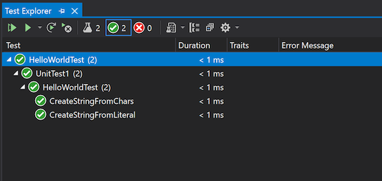

# HelloWorldTest

The classic first application HelloWorld width Cpp Unit Test Framework

# Source

[HelloWorldTest.cpp](./HelloWorldTest.cpp)

[CMakeLists.txt](./CMakeLists.txt)

# Generate and build

To build this project, open "Console" and type following lines:

````
mkdir build && cd build
cmake .. 
start HelloWorldTest.sln
```

Open "Test/Test Explorer" with Ctrl+E,t, select "HelloWorldRTest" test and type Ctrl+R,t to build and run tests.

# Output


