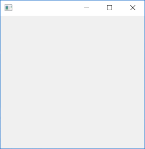

# ApplicationIcon

This example demonstrates the use of GetMessage and DispatchMessage loop.

# Source

[ApplicationIcon.cpp](./ApplicationIcon.cpp)

[CMakeLists.txt](./CMakeLists.txt)

# Output



