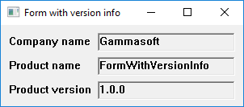

# FormWithVersionInfo

This example demonstrates the use of Form control and version informations.

# Source

[FormWithVersionInfo.cpp](./FormWithVersionInfo.cpp)

[FormWithVersionInfo.rc](./FormWithVersionInfo.rc)

[CMakeLists.txt](./CMakeLists.txt)

# Output

