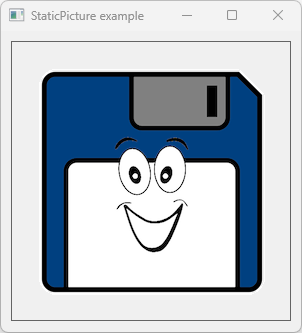

# StaticPicture

This example demonstrates the use StaticPicture.


# Source

[Resources/Logo.bmp](Resources/Logo.bmp)

[StaticPicture.cpp](StaticPicture.cpp)

[CMakeLists.txt](CMakeLists.txt)

# Generate and build

To build this project, open "Console" and type following lines:

``` shell
mkdir build && cd build
cmake .. 
start StaticPicture.sln
```

Select "StaticPicture" project and type Ctrl+F5 to build and run it.

# Output



