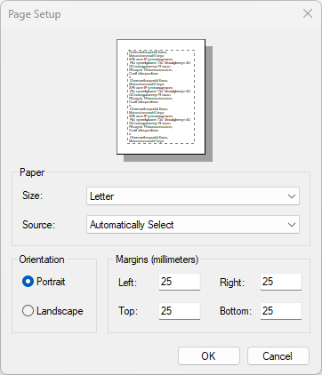

# PageSetupDialog

This example demonstrates the use of PageSetupDialog dialog.

# Source

[PageSetupDialog.cpp](PageSetupDialog.cpp)

[CMakeLists.txt](CMakeLists.txt)

# Generate and build

To build this project, open "Console" and type following lines:

``` shell
mkdir build && cd build
cmake .. 
start PageSetupDialog.sln
```

Select "PageSetupDialog" project and type Ctrl+F5 to build and run it.

# Output


