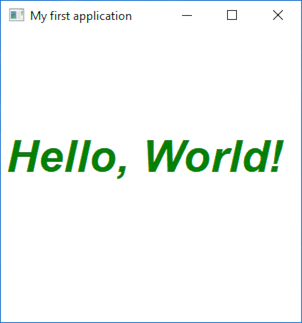

# HelloWorldEmoticons

The classic first application "Hello World".

# Source

[HelloWorldEmoticons.cpp](HelloWorldEmoticons.cpp)

[CMakeLists.txt](CMakeLists.txt)

# Generate and build

To build this project, open "Console" and type following lines:

``` shell
mkdir build && cd build
cmake .. 
start HelloWorld.sln
```

Select "HelloWorld" project and type Ctrl+F5 to build and run it.

# Output




